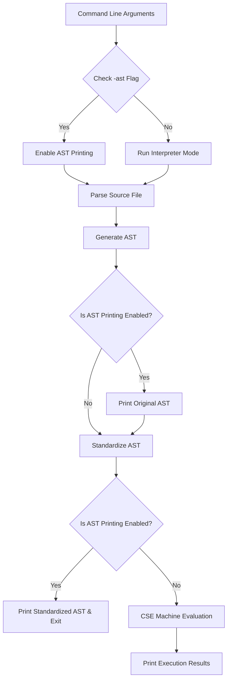

# Entry Point (main)

The `src/main.cpp` file contains the entry point for the RPAL interpreter. It handles command line argument parsing, coordinates parsing/standardizing/evaluation, and manages exception handling.

## Files
- `src/main.cpp`: Orchestrates the interpreter pipeline.

## Execution Pipeline Flow

## CLI Configuration
The interpreter accepts a single source file path and an optional `-ast` flag:
- **`./rpal20 [-ast] <filename>`**
  - `<filename>`: Path to the RPAL source file to evaluate.
  - `-ast`: Prints both the Original AST and the Standardized AST to `stdout` instead of evaluating the program.

## Error Handling
The program wraps all stages in a comprehensive `try-catch` block:
- Syntax errors raised during parsing (e.g., mismatched brackets, unexpected tokens) are caught and reported.
- Runtime errors raised during CSE Machine execution (e.g., division by zero, stack underflows, type assertion failures, undeclared identifier lookups) are printed to `stderr` with a non-zero exit code.
